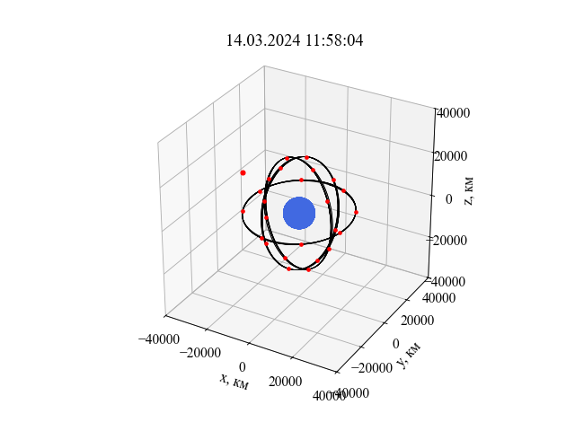

# Лаборатная работа по динамике искусственных спутников Земли

## О проекте

Этот проект является лабораторной работой, выполненной мной на 4 курсе университета. С его помощью можно изучать движение как одного спутника, задавая его параметры, так и целой группировки ГЛОНАСС.

В данной работе реализован метод парсинга данных о положении спутников ГЛОНАСС с сайта https://glonass-iac.ru/glonass/ и построения на их основе различных графиков для изучения движения орбитальной группировки.

Помимо построения графиков, скрипт выполняет различные вычисления, такие как:
- определение координат спутника методом триангуляции, 
- вычисление значения возмущающей функции, действующей на спутник, 
- спутниковое нивелирование (определение превышения подспутниковой точки над поверхностью эллипсоида),
- определение зон видимости из точки наблюдения на поверхности Земли,
- определение зон видимости со спутника. 

## Примеры

### `Построение трассы геостационарного спутника`

*Трасса спутника* - это проекция орбиты искусственного спутника Земли на поверхность Земли. Другими словами — трасса движения подспутниковой точки по поверхности Земли.

Рассмотрим работу программы на примере геостационарного спутника, большая полуось орбиты которого имеет значение `42165` км.  


На данном рисунке красной точкой показано начальное положение спутника, а чёрными - его положения в разные моменты времени в течение суток.

### `Построение орбиты геостационарного спутника в 3D проекции`


С помощью данного функционала можно оценить орбиту спутника относительно Земли.

### `Анимация полёта геостационарного спутника в 3D проекции`


### `Положение спутников ГЛОНАСС в заданный момент времени`


Программа позволяет получить положение спутников ГЛОНАСС в земной системе координат на заданный в файле конфигурации момент времени.  

### `Трассы спутников ГЛОНАСС`


### `Орбиты спутников ГЛОНАСС`



### `Определение и построение зон видимости из пункта наблюдения на поверхности Земли`

Определение зон видимости является важной задачей в работе с ИСЗ, поскольку при наблюдениях за ним необходимо учитывать, когда спутник уйдёт из видимости. Также это может использоваться для организации межспутникового взаимодействия. 


Зелёная точка - пункт наблюдения с координатами (0°, 0°)

Красная точка - пункт наблюдения в городе Томск с координатами (56°29'19", 84°57'8")

### `Определение и построение зон видимости со спутника`


---

## Запуск

> 1) Создание виртуального окружения
```bash
>>> python -m venv venv
>>> venv/Scripts/activate
```

> 2) Установка зависимостей

```bash
>>> pip install -r requirements.txt
``` 

> 3) Запуск программы

В случае, если необходима работа с задачами исследования динамики ИСЗ

```bash 
>>> python programs/ISZ_main.py
``` 

Если же Вы нуждаетесь в вычислениях для спутниковой геодезии

```bash
>>> python programs/SG_main.py
```